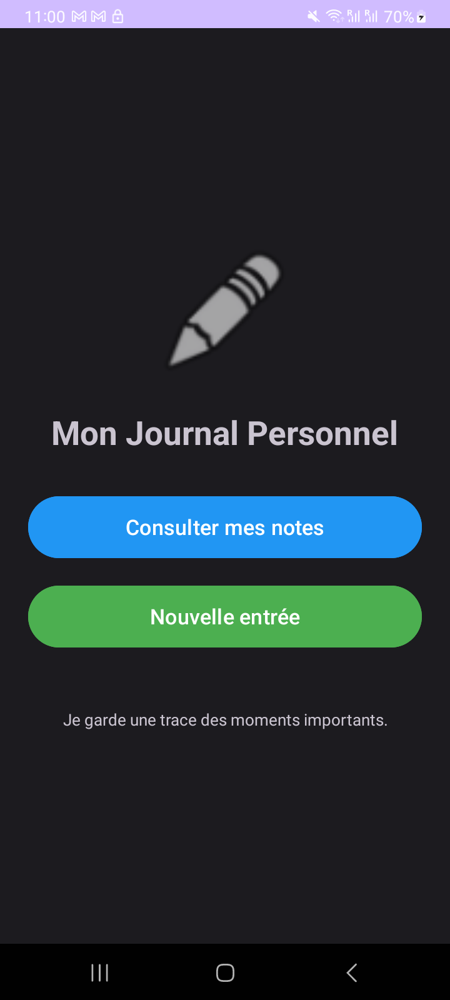
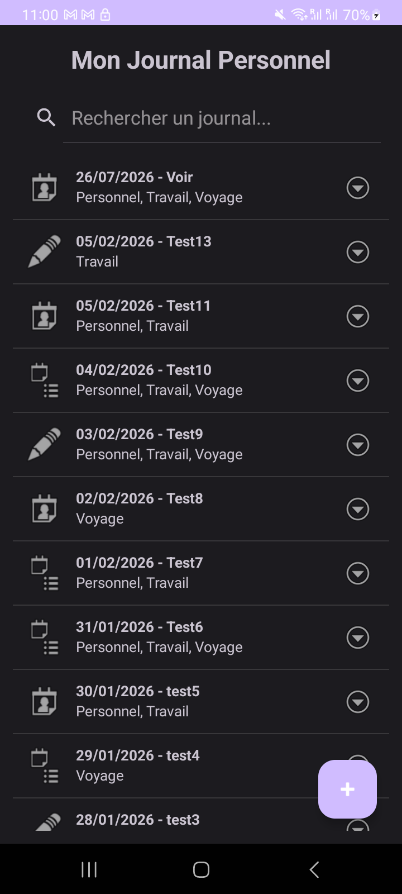
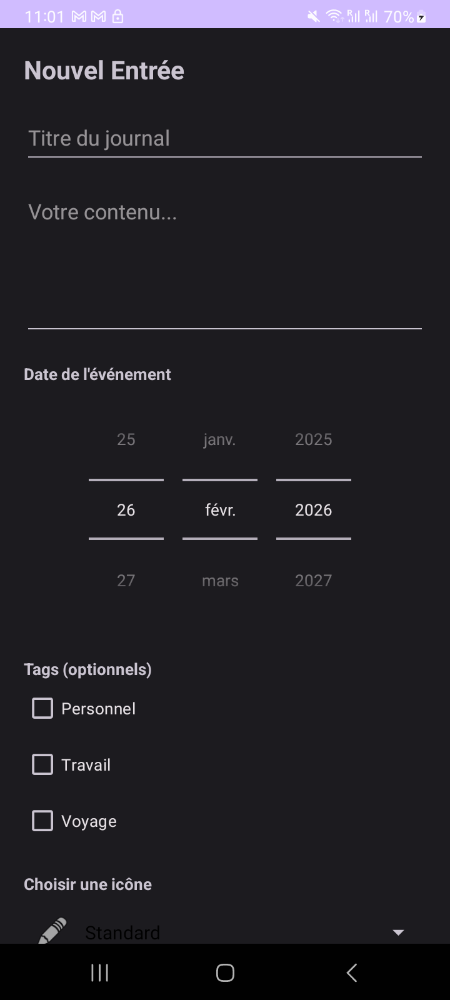
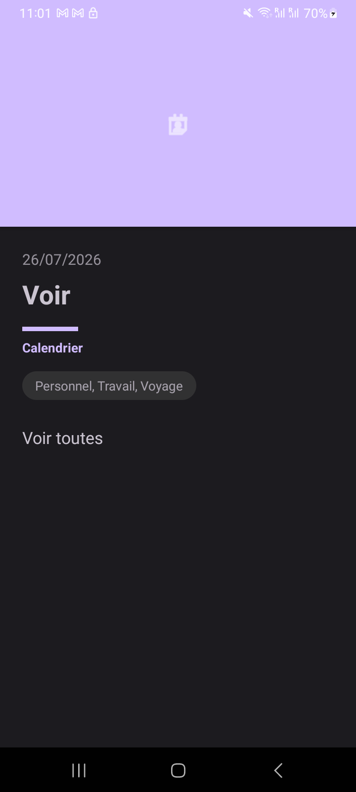
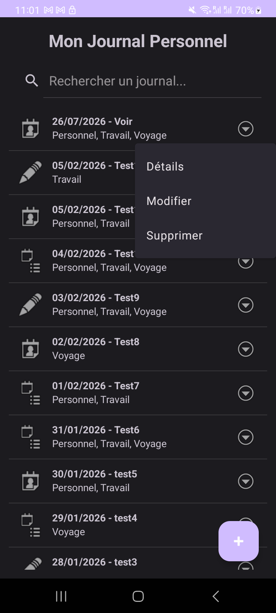
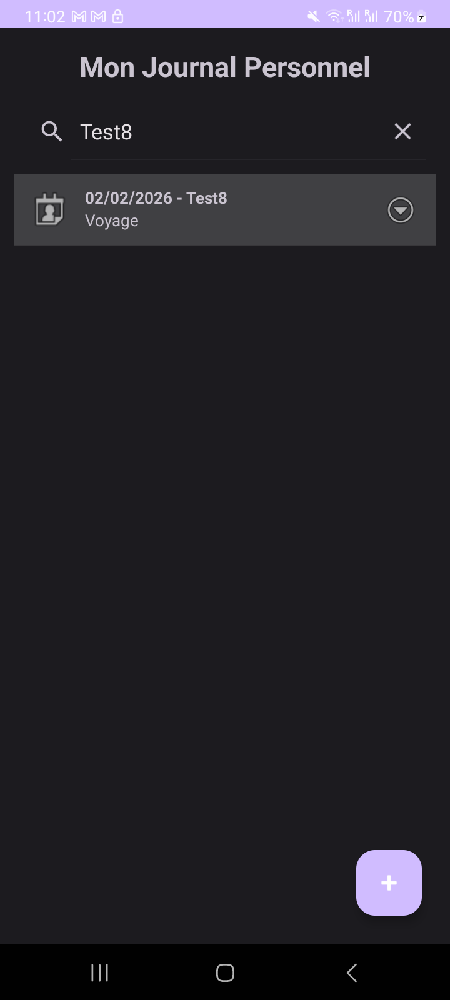
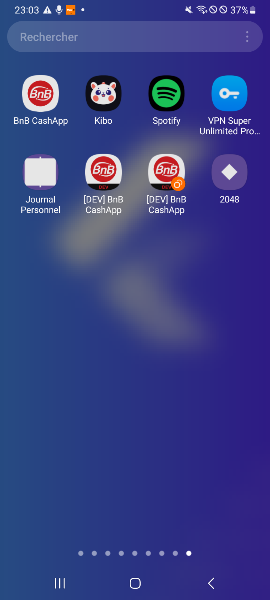
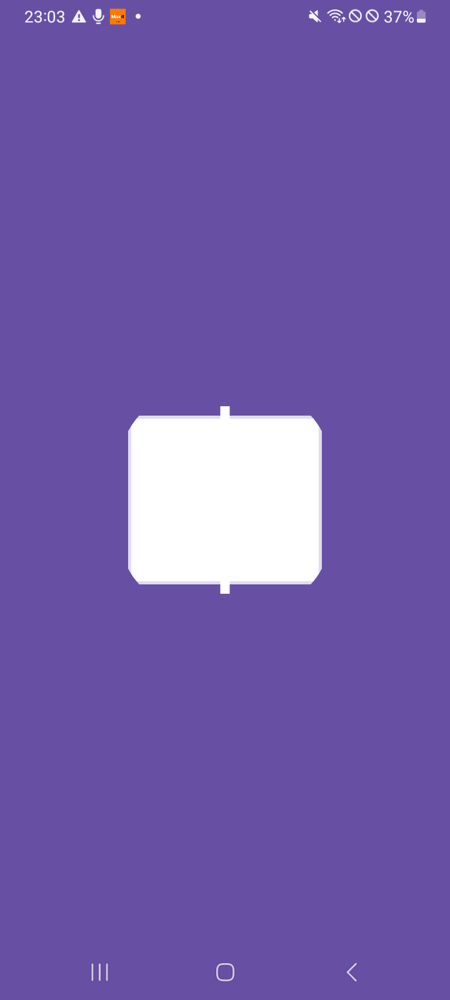

# Journal Personnel - Application Android

## Présentation
**Journal Personnel** est une application Android moderne conçue pour permettre aux utilisateurs de consigner leurs souvenirs, pensées et moments importants. L'application offre une interface fluide, intuitive et respecte les standards de design actuels.

## Fonctionnalités
- **Gestion Complète des Entrées** : Création, consultation, modification et suppression (CRUD) de notes de journal.
- **Détails Riches** : Chaque note contient un titre, un contenu textuel, une date précise et des tags personnalisés.
- **Navigation Multi-Activités** :
  - **Accueil** : Écran de bienvenue avec accès rapide à la liste et à la création.
  - **Liste** : Vue d'ensemble de tous les journaux enregistrés avec recherche intégrée.
  - **Détails** : Affichage plein écran d'une note avec un design premium.
  - **Ajout/Édition** : Formulaire complet avec sélecteur de date et gestion des tags.
- **Recherche Instantanée** : Barre de recherche permettant de filtrer les notes par titre, contenu, tags ou date.
- **Thème Adaptatif** : Support complet du **Mode Sombre** et **Mode Clair** selon les réglages du système.
- **Bouton d'Action Rapide (FAB)** : Accès direct à la création depuis l'écran de liste.

## Captures d'écran

### Écran d'accueil

### Liste des journaux

### Création d'un journal

### Écran de détails

### Menu d'options

### Autres aperçus

## Spécifications Techniques
- **Langage** : Java
- **Base de Données** : SQLite (persistance locale)
- **Architecture** : Intent-based Multi-Activity
- **Composants UI** :
  - `ListView` avec adapter personnalisé.
  - `NestedScrollView` pour une lecture fluide des détails.
  - `FloatingActionButton` pour l'ergonomie.
  - `SearchView` pour le filtrage dynamique.
  - `Material Design` pour les composants et les thèmes.

## Utilisation
1. Lancez l'application sur un émulateur ou un appareil Android.
2. Depuis l'écran d'accueil, cliquez sur **"Nouvelle Entrée"** pour créer votre premier journal.
3. Gérez vos notes via la liste, utilisez le clic long pour les options rapides ou la barre de recherche pour retrouver un souvenir spécifique.

---
*Développé dans le cadre du module Développement sous Smartphone (2025/2026).*
